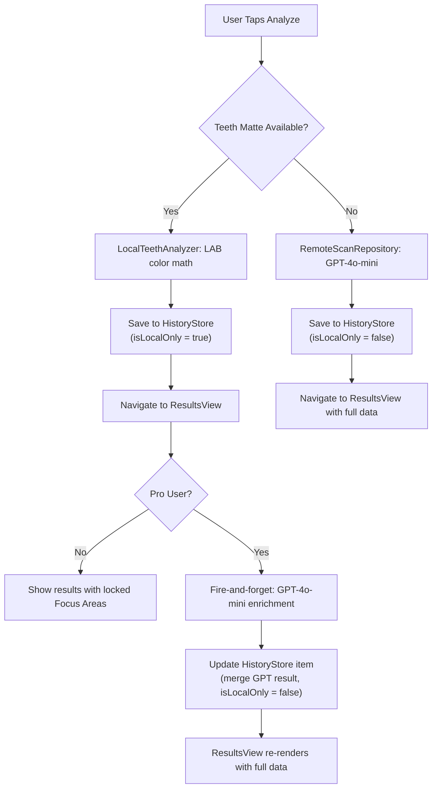

# Hybrid Local/Cloud Teeth Analysis -- Implementation Plan

## Summary

Camera photos use Apple's built-in `AVSemanticSegmentationMatte.MatteType.teeth` for instant local analysis. Free users get score, shade, and a template takeaway. Pro users get the same instant local result plus GPT-4o-mini enrichment (detected issues, personalized takeaway, referral check) loading in the background. Library photos are Pro-only and go through GPT. A developer toggle in Settings allows instant Free/Pro switching with no restart.

## User Experience Matrix

- **Free + camera**: Instant local result (score, shade, template takeaway). Focus Areas section appears locked. Library picker visible but locked.
- **Pro + camera**: Instant local result shown immediately. GPT enrichment loads in background. Focus Areas, personalized takeaway, referral check fill in when GPT returns. Results view updates live.
- **Pro + library**: GPT-only analysis (current flow, full results).
- **Matte unavailable**: Falls back to GPT (edge case on older devices).

## Scan Flow Diagram




---

## File-by-File Changes

### NEW: `Gleam/Support/Camera/TeethCaptureSession.swift`

Custom AVFoundation camera that captures photos with the teeth segmentation matte.

- Configure `AVCaptureSession` with `AVCaptureDevice.default(.builtInTrueDepthCamera, for: .video, position: .front)`
- Fall back to `.builtInWideAngleCamera` position `.front` if TrueDepth unavailable
- `AVCapturePhotoOutput` with `enabledSemanticSegmentationMatteTypes = [.teeth]`
- SwiftUI-compatible `UIViewRepresentable` wrapping `AVCaptureVideoPreviewLayer`
- Custom shutter button, preview, dismiss (mirror current UIImagePickerController UX)
- Delegate extracts JPEG + teeth matte `CIImage` on capture
- Camera permission handling with graceful fallback

### NEW: `Gleam/Core/CoreDomain/LocalTeethAnalyzer.swift`

Pure computation struct with a single static `analyze` method.

```swift
struct LocalTeethAnalyzer {
    static func analyze(imageData: Data, teethMatte: CIImage) -> ScanResult
}
```

Algorithm (runs synchronously, <100ms):

1. Create `CIImage` from photo data, scale matte to match dimensions
2. Apply matte as alpha mask (pixels with matte > 0.5 = teeth)
3. Render masked region to bitmap via `CIContext`
4. Convert each teeth pixel: sRGB -> linearize -> XYZ (D65) -> CIELAB
5. Average L, a, b across all teeth pixels
6. Whiteness score: `clamp(Int((meanL - 40) * (100/55)), 0, 100)`
7. VITA shade: Delta-E (CIE76) distance to reference LAB values for each VITA shade, pick nearest
8. Confidence from matte pixel count / expected region area
9. Template takeaway from score bucket
10. Return `ScanResult` with `detectedIssues: []`, `referralNeeded: false`, standard disclaimer

### NEW: `Gleam/Core/CoreDomain/ProAccessProvider.swift`

```swift
final class ProAccessProvider: ObservableObject {
    private static let devOverrideKey = "dev_pro_override"

    @Published var isPro: Bool {
        didSet { UserDefaults.standard.set(isPro, forKey: Self.devOverrideKey) }
    }

    init() {
        self.isPro = UserDefaults.standard.bool(forKey: Self.devOverrideKey)
    }
}
```

No protocol needed. Future StoreKit can be added directly to this class (check entitlements in `isPro` getter) or by subclassing.

### MODIFY: `[CameraCaptureView.swift](Gleam/Support/Camera/CameraCaptureView.swift)`

- Add `CaptureResult` struct:

```swift
  struct CaptureResult {
      let imageData: Data
      let teethMatte: CIImage?
  }
  

```

- Change callback from `(Data?) -> Void` to `(CaptureResult?) -> Void`
- Replace `UIImagePickerController` branch (lines 20-28) with `TeethCaptureSession`-backed controller
- Simulator `PHPickerViewController` returns `CaptureResult(imageData: data, teethMatte: nil)`
- Image compression unchanged (max 1024px, JPEG 0.7)

### MODIFY: `[HistoryItem.swift](Gleam/Core/CoreDomain/HistoryItem.swift)`

Add `isLocalOnly` property:

```swift
struct HistoryItem: Identifiable, Equatable, Hashable, Codable {
    let id: String
    let createdAt: Date
    var result: ScanResult          // changed from let to var (for GPT enrichment update)
    let contextTags: [String]
    var isLocalOnly: Bool            // new, default false

    enum CodingKeys: String, CodingKey {
        case id, createdAt, result, contextTags, isLocalOnly
    }
}
```

- `isLocalOnly` defaults to `false` in `init(from decoder:)` for backward compat with existing saved history
- `result` changes from `let` to `var` so GPT enrichment can update it

### MODIFY: `[HistoryStore.swift](Gleam/Core/CoreDomain/HistoryStore.swift)`

Add method for GPT enrichment to update an existing item:

```swift
func enrichResult(for id: String, with newResult: ScanResult) {
    guard let index = items.firstIndex(where: { $0.id == id }) else { return }
    items[index].result = newResult
    items[index].isLocalOnly = false
    // Persist the update
    if let persistent = repository as? PersistentHistoryRepository {
        Task { await persistent.replaceAll(with: items) }
    }
}
```

Because `items` is `@Published`, this triggers SwiftUI re-renders in any view reading from the store.

### MODIFY: `[ScanView.swift](Gleam/Features/ScanFeature/ScanView.swift)`

**a) New state and environment:**

```swift
@State private var teethMatte: CIImage? = nil
@EnvironmentObject private var proAccess: ProAccessProvider
```

**b) Locked library picker** -- replace both `PhotosPicker` instances (line 78 and line 118):

```swift
if proAccess.isPro {
    PhotosPicker(selection: $photoItem, matching: .images) { ... }
        .buttonStyle(FloatingSecondaryButtonStyle())
} else {
    // Locked picker: visible but disabled, with lock icon + PRO badge
    Button { } label: {
        HStack(spacing: 12) {
            Image(systemName: "lock.fill").font(.caption)
            Image(systemName: "photo.on.rectangle").font(.title3).fontWeight(.semibold)
            Text("Choose from Library").font(.headline).fontWeight(.semibold)
            Text("PRO").font(.caption2).bold()
                .padding(.horizontal, 6).padding(.vertical, 2)
                .background(Capsule().fill(Color.accentColor))
                .foregroundColor(.white)
        }
        .frame(maxWidth: .infinity).padding(.vertical, 18)
    }
    .buttonStyle(FloatingSecondaryButtonStyle())
    .disabled(true).opacity(0.5)
}
```

**c) Camera callback** (line 182-191):

```swift
CameraCaptureView { result in
    if let result = result {
        selectedImageData = result.imageData
        teethMatte = result.teethMatte
        selectedTagIDs.removeAll()
    }
    showCamera = false
}
```

**d) Branched `analyze()` method:**

```swift
@MainActor
private func analyze() async {
    guard let data = selectedImageData else { return }

    // ... existing face/smile validation (unchanged) ...

    isAnalyzing = true
    let selectedTags = stainTags.filter { selectedTagIDs.contains($0.id) }
    let capturedMatte = teethMatte  // capture before defer clears it

    defer {
        isAnalyzing = false
        selectedImageData = nil
        teethMatte = nil
        selectedTagIDs.removeAll()
    }

    if let matte = capturedMatte {
        // LOCAL ANALYSIS: teeth matte available
        let localResult = LocalTeethAnalyzer.analyze(imageData: data, teethMatte: matte)
        let outcomeId = UUID().uuidString
        let outcome = AnalyzeOutcome(
            id: outcomeId, createdAt: Date(),
            result: localResult, contextTags: selectedTags.map { $0.id }
        )
        historyStore.append(outcome: outcome, imageData: data,
                           fallbackContextTags: selectedTags.map { $0.id })
        onFinished(localResult)

        // PRO ENRICHMENT: fire-and-forget GPT call
        if proAccess.isPro {
            Task.detached { [scanRepository, historyStore] in
                let imageToAnalyze = await cropImageToTeethRegion(imageData: data) ?? data
                let tagKeywords = selectedTags.map { $0.promptKeyword }
                // ... build previousTakeaways, recentTagHistory from historyStore ...
                if let gptOutcome = try? await scanRepository.analyze(
                    imageData: imageToAnalyze, tags: tagKeywords,
                    previousTakeaways: previousTakeaways,
                    recentTagHistory: recentTagHistory
                ) {
                    await MainActor.run {
                        historyStore.enrichResult(for: outcomeId, with: gptOutcome.result)
                    }
                }
            }
        }
    } else {
        // REMOTE ANALYSIS: no matte (library photo or matte unavailable)
        do {
            let imageToAnalyze = await cropImageToTeethRegion(imageData: data) ?? data
            let tagKeywords = selectedTags.map { $0.promptKeyword }
            let previousTakeaways = historyStore.items
                .compactMap { $0.result.personalTakeaway.isEmpty ? nil : $0.result.personalTakeaway }
                .prefix(5)
            let recentTagHistory = historyStore.items.prefix(5).map { $0.contextTags }

            let outcome = try await scanRepository.analyze(
                imageData: imageToAnalyze, tags: tagKeywords,
                previousTakeaways: Array(previousTakeaways),
                recentTagHistory: Array(recentTagHistory)
            )
            historyStore.append(outcome: outcome, imageData: data,
                               fallbackContextTags: selectedTags.map { $0.id })
            onFinished(outcome.result)
        } catch { }
    }
}
```

**e) `.onAppear`** also picks up `scanSession.capturedTeethMatte`.

### MODIFY: `[ResultsView.swift](Gleam/Features/ResultsFeature/ResultsView.swift)`

**a) Make result reactive** -- instead of using the `let result` parameter directly, read from the store when possible:

```swift
@EnvironmentObject private var proAccess: ProAccessProvider

private var displayResult: ScanResult {
    matchedHistoryItem?.result ?? result
}

private var isLocalOnly: Bool {
    matchedHistoryItem?.isLocalOnly ?? false
}
```

Use `displayResult` everywhere in the view body instead of `result`.

**b) Locked "Focus Areas" card** -- replace the current conditional:

Current ([ResultsView.swift line 54](Gleam/Features/ResultsFeature/ResultsView.swift)):

```swift
if !result.detectedIssues.isEmpty {
    DetectedIssuesSection(issues: result.detectedIssues)
}
```

New:

```swift
if !displayResult.detectedIssues.isEmpty {
    DetectedIssuesSection(issues: displayResult.detectedIssues)
} else if isLocalOnly {
    if proAccess.isPro {
        // Pro user, GPT still loading
        LockedInsightCard(title: "Focus Areas", icon: "exclamationmark.triangle.fill", isLoading: true)
    } else {
        // Free user, show locked
        LockedInsightCard(title: "Focus Areas", icon: "exclamationmark.triangle.fill", isLoading: false)
    }
}
```

**c) New `LockedInsightCard` component:**

```swift
private struct LockedInsightCard: View {
    let title: String
    let icon: String
    let isLoading: Bool

    var body: some View {
        InsightCard(title: title, icon: icon) {
            if isLoading {
                HStack(spacing: 12) {
                    ProgressView()
                    Text("Analyzing with AI...")
                        .font(.subheadline)
                        .foregroundStyle(.secondary)
                }
                .frame(maxWidth: .infinity, alignment: .center)
                .padding(.vertical, AppSpacing.m)
            } else {
                VStack(spacing: AppSpacing.s) {
                    Image(systemName: "lock.fill")
                        .font(.title2)
                        .foregroundStyle(.secondary)
                    Text("Upgrade to Pro for detailed issue detection and personalized coaching")
                        .font(.subheadline)
                        .foregroundStyle(.secondary)
                        .multilineTextAlignment(.center)
                }
                .frame(maxWidth: .infinity)
                .padding(.vertical, AppSpacing.m)
            }
        }
    }
}
```

**d) Personal Takeaway updates live** -- no special handling needed. When GPT returns and `historyStore.enrichResult` is called, `displayResult.personalTakeaway` changes from the template to GPT's personalized version, and the `ResultHeadlineCard` re-renders automatically.

### MODIFY: `[HistoryView.swift](Gleam/Features/HistoryFeature/HistoryView.swift)` -- HistoryCardView

Add a subtle indicator for local-only scans inside `HistoryCardView` (line 284):

```swift
@EnvironmentObject private var proAccess: ProAccessProvider
```

In the card body, after the takeaway text (line 362-367), add:

```swift
if item.isLocalOnly && !proAccess.isPro {
    HStack(spacing: 6) {
        Image(systemName: "lock.fill")
            .font(.caption2)
        Text("Upgrade for full analysis")
            .font(.caption)
    }
    .foregroundStyle(.secondary)
    .padding(.horizontal, 12).padding(.vertical, 6)
    .background(Capsule().fill(Color(.tertiarySystemBackground)))
}
```

Also pass `historyItemId` when navigating from history to ResultsView. Currently `NavigationLink(value: item.result)` (line 41) navigates by result. This should also pass the item ID so ResultsView can do reactive lookups. This depends on how navigation is set up in ContentView -- may need a minor tweak to the navigation destination.

### MODIFY: `[SettingsView.swift](Gleam/Features/SettingsFeature/SettingsView.swift)`

Add at top:

```swift
@EnvironmentObject private var proAccess: ProAccessProvider
```

Add after the "Onboarding" section (line 63):

```swift
#if DEBUG
Section(header: Text("Developer")) {
    Toggle("Pro Access", isOn: $proAccess.isPro)
    Text(proAccess.isPro ? "Using Pro features" : "Using Free features")
        .font(.caption)
        .foregroundStyle(.secondary)
}
#endif
```

No restart needed. Toggling `isPro` immediately re-renders every view that reads `proAccess.isPro`.

### MODIFY: `[ScanSession.swift](Gleam/Support/ScanSession.swift)`

```swift
@Published var capturedTeethMatte: CIImage? = nil
```

Clear in `reset()`.

### MODIFY: `[GleamApp.swift](Gleam/GleamApp.swift)`

```swift
@StateObject private var proAccessProvider = ProAccessProvider()
```

In body:

```swift
ContentView()
    // ... existing modifiers ...
    .environmentObject(proAccessProvider)
```

---

## What Stays Untouched

- `RemoteScanRepository.swift` -- no changes
- `Repositories.swift` -- no protocol changes
- `Models.swift` -- `ScanResult` struct unchanged
- `Environment.swift` -- no new keys (ProAccessProvider uses EnvironmentObject)
- `APIConfiguration.swift` -- no changes
- Firebase backend (`functions/src/index.ts`) -- no changes
- `HTTPClient.swift` -- no changes

## Future Subscription Integration (NOT in this implementation)

1. Add StoreKit 2 entitlement checking inside `ProAccessProvider.isPro` getter
2. Add `PaywallView` presented when free user taps locked picker or locked Focus Areas card
3. Optionally: "re-analyze" button on old local-only scans to enrich them with GPT after upgrading
4. Zero changes needed in ScanView, LocalTeethAnalyzer, or ResultsView

## Implementation Order

1. **TeethCaptureSession** -- custom AVCaptureSession camera (most code, foundation)
2. **CameraCaptureView** -- wire new camera, change callback to CaptureResult
3. **LocalTeethAnalyzer** -- LAB color math, shade mapping, score computation
4. **ProAccessProvider** -- ObservableObject class
5. **HistoryItem** -- add isLocalOnly, change result to var
6. **HistoryStore** -- add enrichResult method
7. **GleamApp** -- inject ProAccessProvider
8. **SettingsView** -- add DEBUG developer toggle
9. **ScanSession** -- add teethMatte property
10. **ScanView** -- routing logic, locked picker, two-phase Pro flow
11. **ResultsView** -- reactive result, locked/loading cards
12. **HistoryCardView** -- locked indicator on local-only cards
13. **Build and test on physical iPhone**

